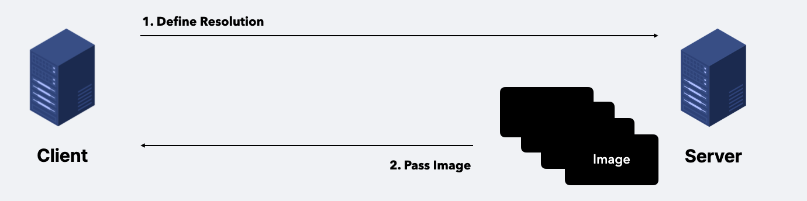
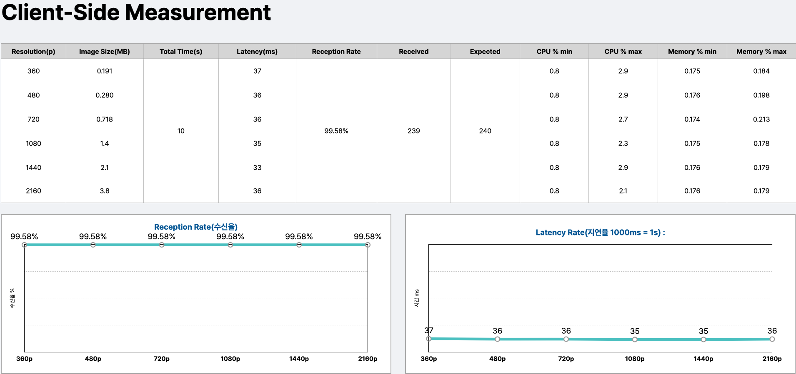
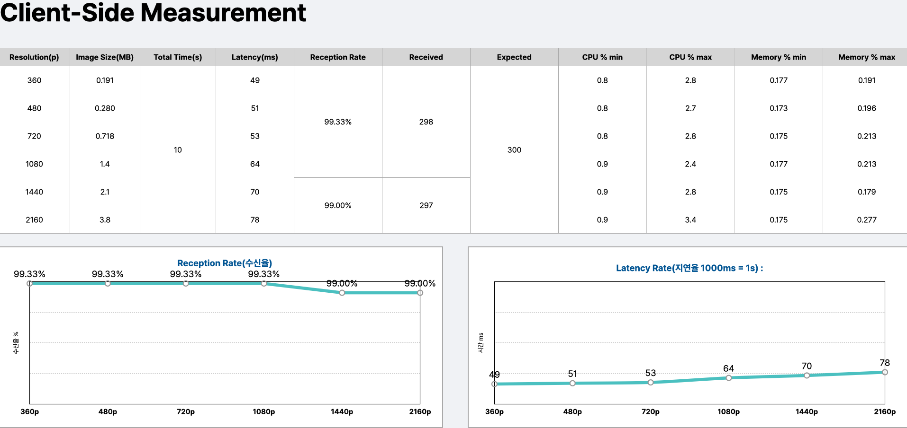
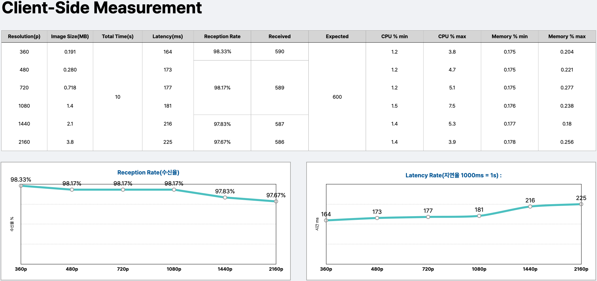
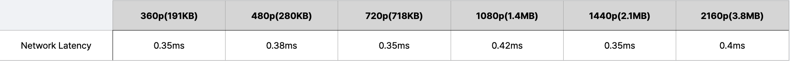
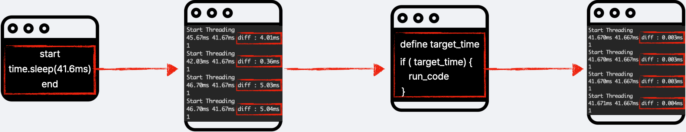

<a name="readme-top"></a>


<!-- PROJECT LOGO -->
<br />
<div align="center">
    <h2 align="center">Measuring gRPC Video Streaming performance</h2>
    <h6>2022-2 KHU SW-Capstone Design Project</h6>
</div>

<br></br>

<!-- ABOUT THE PROJECT -->
## About the project
gRPC Framework is a open source high performance RPC(Remote Procedure Call) framework made by Google. HLS stands for HTTP Live Streaming and is a technology for delivering video and audio media over the Internet. As more and more companies provide OTT services such as YouTube, Netflix, and Watcha, the importance of HLS technology is emerging. As the name suggests, HLS requires a network. This project aims to evaluate gRPC performance whether gRPC can provide a stable and fast communication.
<p align="right">(<a href="#readme-top">back to top</a>)</p>

## Problem Definition
Performance is measured for 360p, 480p, 720p, 1080p, 1440p, 2160p by 24, 30, and 60 FPS during 10 seconds
<p align="right">(<a href="#readme-top">back to top</a>)</p>

## Test Environment
|      Hardware     |          OS         | Core        | RAM  |  SSD  | Network Average Speed | Network Max Speed | python version | grpcio version | grpcio-tools version |
| :---------------: | :-----------------: | :---:       | :--: | :---: | :-------------------: | :---------------: | :------------: | :------------: | :------------------: |
| Macbook Pro(2020) | macOS Monterey 12.4 | M1(8)       | 16GB | 256GB | 33Mbps                | 77Mbps            | 3.9.13         | 1.49.1         | 1.16.1               |
<p align="right">(<a href="#readme-top">back to top</a>)</p>

## Test Workflow

<p align="right">(<a href="#readme-top">back to top</a>)</p>

<!-- GETTING STARTED -->
## Getting Started
### 1. Installation
1. Clone the repo
   ```sh
   git clone git@github.com:isthisdan/grpc-video-streaming.git
   ```
2. Install package
   ```sh
   // conda
   conda install --yes --file conda_requirements.txt
   ```

### 2. Settings
1. Define your test condition
    ```py 
        class ClientC:
            IMAGE = "1080p.jpg"
            FPS = 24
            MAX_TIME = 10


        class ServerC:
            FPS = 24
            MAX_TIME = 10
    ```

### 2. Run gRPC
1. Run Server
    ```sh
    python3.9 server.py
    ```
2. Run Client
    ```sh
    python3.9 client.py
    ```
<p align="right">(<a href="#readme-top">back to top</a>)</p>

## Test Result
```
Client : Macbook M1 Pro(2020)
Server : Macbook M1 Pro(2020)
```
### 24FPS

<h5 align='center'>[Figure1] 24FPS Video Streaming Result</h5>

### 30FPS

<h5 align='center'>[Figure2] 30FPS Video Streaming Result</h5>

### 60FPS

<h5 align='center'>[Figure3] 60FPS Video Streaming Result</h5>

See the <a href="https://github.com/isthisdan/grpc-matrix-multiplication/tree/main/result">Execution log</a> for more information.

<p align="right">(<a href="#readme-top">back to top</a>)</p>

### Conclusion
As a result, the reception rate was over 97%, average CPU usage was 2.3%, and average memory usage was 0.2%. One fact that can be found through the reception rate charts of [Figure1], [Figure2], and [Figure3] is that there are problems that reception rate does not come up to 100% even in small images like 360p. There are two causes. Before we get in, 24FPS means that 24 pictures are shown at regular intervals in 1 second. This can be interpreted as interval time must be strictly protected to view 24 pictures in 1 second.
</br>


<h5 align='center'>[Figure4] gRPC Network Latency</h5>
</br>

First, as you can see on **[Figure4]** gRPC network latency took about 0.4ms average. But, this is relative value. It could be inceased or decreased by physical distance between two PCs. Therefore, the network latency was not considered in the this experiment interval. 
</br>


<h5 align='center'>[Figure5] Setting Interval Time</h5>
</br>

Secondly, the perfect time control to set interval was impossible to me. I first used system function, time to implement interval. it was found that the program slept longer than the fixed time when using time.sleep() function. There are various of reasons why this occurs. Follow the <a href="https://blat-blatnik.github.io/computerBear/making-accurate-sleep-function/">Link</a> for more information. I removed time.sleep() function to reduce this time delay and make program to send image on targeted time as shown in **[Figure5]**. The error was reduced remarkably but still there were some delays.

Nevertheless, what is noteworthy is that video streaming through gRPC is possible with a reception rate of over 97% with low resource consumption. Reception Rate could reach to 100%, if the problem of interval implementation is solved.

Additionally, gRPC is set to receive maxium up to 4MB of data at a time. If needed, reception size could be changed through additional settings on gRPC channel. Follow the <a href="https://learn.microsoft.com/en-us/aspnet/core/grpc/security?view=aspnetcore-7.0">Link</a> for more information.

<p align="right">(<a href="#readme-top">back to top</a>)</p>

<!-- LICENSE -->
## License

Distributed under the MIT License. See `LICENSE.txt` for more information.

<p align="right">(<a href="#readme-top">back to top</a>)</p>

<!-- CONTACT -->
## Contact

Google Mail - flydanny0511@gmail.com

<p align="right">(<a href="#readme-top">back to top</a>)</p>